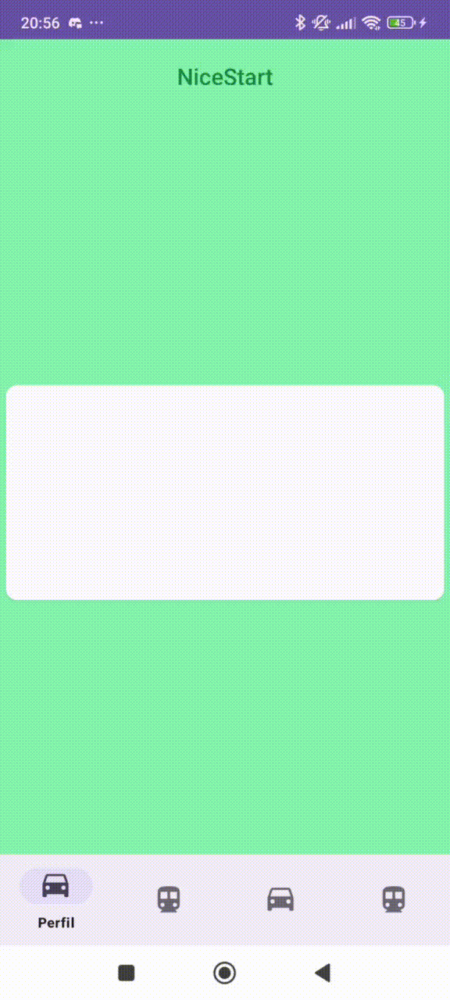
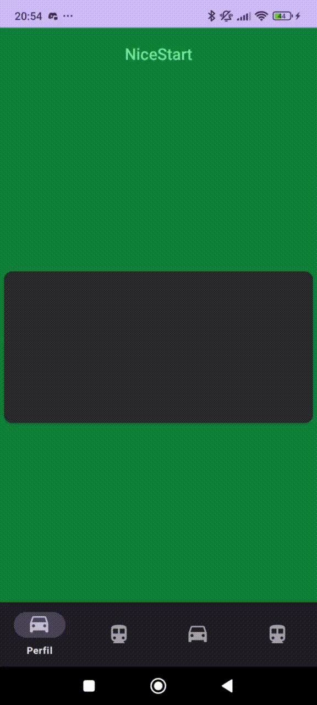
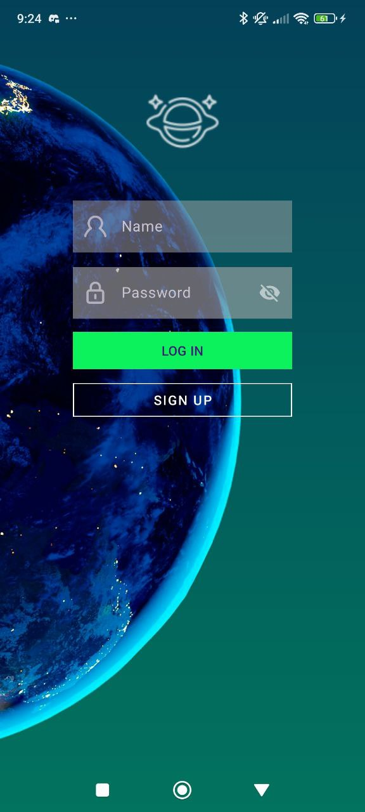

# Creación y Desarrollo de una Aplicación

Este proyecto consta de 5 actividades principales: `LOGIN`, `SIGNUP`, `SPLASH`, `PROFILE` y `MAIN`. Cada una cuenta con versiones en orientación vertical y horizontal y permite la navegación fluida entre ellas. También incluye un modo oscuro, animaciones, un `ViewPager` con `Bottom Navigation` y soporte para cambio de idioma automático según la configuración del dispositivo.

---

## LOGIN

### Vertical Login:


### Landscape Login:


---

## SIGN UP

### Vertical Signup:


### Landscape Signup:


---

## SPLASH SCREEN
La aplicación cuenta con una pantalla de bienvenida (`Splash Screen`) con animaciones atractivas para el logo y el texto.


### Animaciones del logo:
```xml
<?xml version="1.0" encoding="utf-8"?>
<set xmlns:android="http://schemas.android.com/apk/res/android"
    android:fillAfter="true">

    <rotate
        android:duration="200"
        android:fromDegrees="20"
        android:toDegrees="-20"
        android:pivotX="50%"
        android:pivotY="50%"
        android:repeatCount="8"
        android:repeatMode="reverse" />

    <scale
        android:fromXScale="0"
        android:fromYScale="0"
        android:toXScale="1"
        android:toYScale="1"
        android:pivotX="50%"
        android:pivotY="50%"
        android:duration="2000" />

    <translate
        android:fromYDelta="-500%"
        android:toYDelta="0%"
        android:duration="1000" />
</set>
```

### Animaciones del texto:
```xml
<?xml version="1.0" encoding="utf-8"?>
<set xmlns:android="http://schemas.android.com/apk/res/android">
    <scale
        android:fromXScale="0"
        android:fromYScale="0"
        android:toXScale="1"
        android:toYScale="1"
        android:pivotX="50%"
        android:pivotY="50%"
        android:duration="2000" />

    <translate
        android:fromYDelta="500%"
        android:toYDelta="0%"
        android:duration="1000" />
</set>
```

---

## MAIN ACTIVITY
La actividad principal incluye:
- Un `ActionBar` con menú de opciones.
- Un icono para acceder a la actividad `Profile`.
- Un `WebView` que muestra imágenes generadas aleatoriamente de personas ficticias.

Se puede actualizar la vista para generar nuevas imágenes.


---

## PROFILE
La actividad `Profile` contiene un `ImageView` donde se muestra la foto de perfil del usuario.


---

## BOTTOM BAR & SECTION PAGER ADAPTER
Esta actividad implementa un `SectionPagerAdapter` con 4 fragments, cada uno con un botón central. Se permite:
- Navegar entre fragments mediante swipe.
- Uso de una **Bottom Navigation Bar** con 4 botones.



---

## MODO OSCURO
La aplicación adapta automáticamente su apariencia según el modo del dispositivo (claro/oscuro).



---

## SOPORTE MULTILENGUAJE
La aplicación cambia automáticamente de idioma según la configuración del dispositivo.



---

## SOBRE EL PROYECTO
- Proyecto de Desarrollo de Interfaces - Segundo DAM
- Desarrollado en Android con soporte para múltiples orientaciones y estilos visuales.

