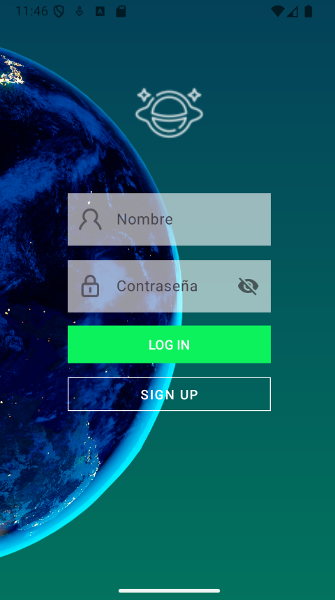
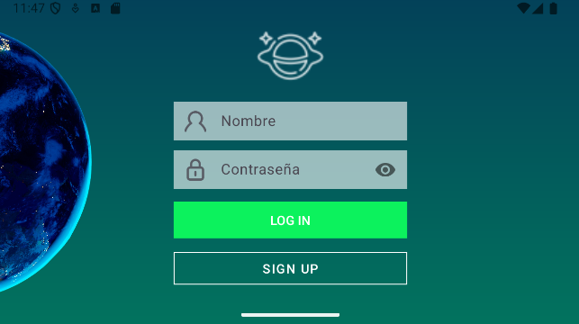
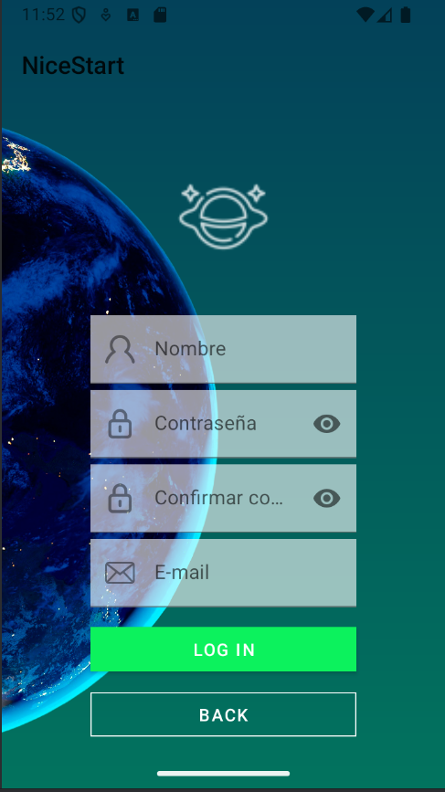
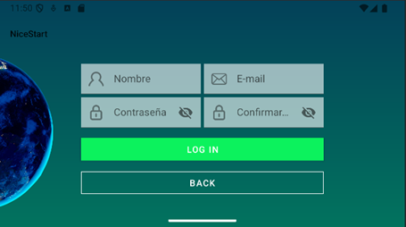
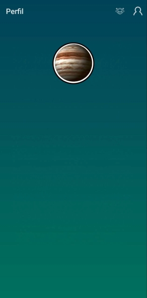

 ## Creación y desarrollo de una aplicacción

El proyecto cuenta con 5 actividades, LOGIN , SIGNUP, las cuales pueden navegar entre ellas, cada una cuenta con una vista vertical y horizontal y una actividad Splash a modo de presentación de la aplicación, la cual cuenta con varias animaciones, una actividad con un perfil y un Main.

### LOGIN:

Vertical login:



Land login



### SIGN UP:

Vertical Signup:



Land Signup



### SPLASH:


Codigo de las animaciones del logo:

```
    <?xml version="1.0" encoding="utf-8"?>
<set xmlns:android="http://schemas.android.com/apk/res/android"
    android:fillAfter="true">

    <rotate
        android:duration="200"
        android:fromDegrees="20"
        android:fillAfter="true"
        android:pivotX="50%"
        android:pivotY="50%"
        android:toDegrees="-20"
        android:repeatCount = "8"
        android:repeatMode = "reverse"
        />
    <scale
        android:fromXScale="0"
        android:fromYScale="0"
        android:toXScale="1"
        android:toYScale="1"
        android:pivotX="50%"
        android:pivotY="50%"
        android:duration="2000"/>
    <translate
        android:fromYDelta="-500%"
        android:toYDelta="0%"
        android:duration="1000"/>
</set>
```

Codigo de las animaciones del texto:

```
<?xml version="1.0" encoding="utf-8"?>
<set xmlns:android="http://schemas.android.com/apk/res/android">
    <scale
        android:fromXScale="0"
        android:fromYScale="0"
        android:toXScale="1"
        android:toYScale="1"
        android:pivotX="50%"
        android:pivotY="50%"
        android:duration="2000"/>
    <translate
        android:fromYDelta="500%"
        android:toYDelta="0%"
        android:duration="1000"/>
</set>
```

### Main:
Esta actividad cuenta con un actionbar que contiene menu de opciones , un icono que te lleva a la actividad profile y un webview que ocupa toda la actividad, el cual muestra una pagina que genera fotos de gente que no existe, pudiendo refrescar la actividad para que vaya generando diferentes tipos de personas.


### Profile:
La actividad profile cuenta solo con un image view en el que se dispone la foto de perfil del usuario.



> Proyecto de Desarrollo de Interfaces de segundo de DAM.
